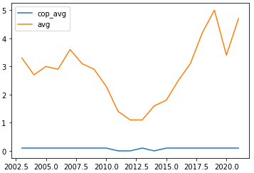

# 42 killings for each policeman's death

Rio de Janeiro is almost reaching its record of deaths caused by police officers. According to official data, from January to May of 2021, 707 people were killed by law enforcement officers in one the most famous states of Brazil.  In the same period, 72 police were killed. 

The average of 4,7 kilings per day is near from the historical record, registered in 2019, when the state had 5 killings per day.

In the chart below, you can check the average of police deaths per day in orange. The killings caused by cops are represented in orange.

